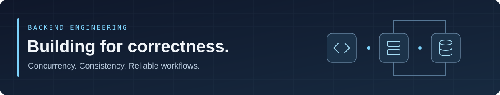

  

# Phan Dinh Phuc

**Java Backend Developer · Information Technology Student at UIT, VNU-HCM**

Building reliable backend systems with Java and Spring Boot. Interested in what happens when requests race, messages retry, and data must stay consistent.

Ho Chi Minh City, Vietnam · **Open to Software Engineer / Java Backend internships**

[Selected projects](#selected-projects) · [Tech stack](#tech-stack) · [Currently learning](#currently-learning)

## About

I'm an Information Technology student at the University of Information Technology, VNU-HCM, focused on Java backend engineering. I enjoy turning business workflows into APIs with clear boundaries, reliable transactions, and meaningful tests.

My current work explores concurrency, data consistency, and event-driven architecture through a flash-sale platform and a library management system.

## Tech Stack

| Area | Technologies |
| :--- | :--- |
| **Backend** | Java 21 · Spring Boot · Spring Security · Spring Data JPA |
| **Data & messaging** | PostgreSQL · Redis · Apache Kafka |
| **Testing** | JUnit 5 · Testcontainers · Integration & concurrency testing |
| **Tools** | Docker · Git · Maven |

## Selected Projects

### 01 / High-Concurrency Flash Sale Engine

**Featured project** · `Java 21` `Spring Boot` `Redis` `Kafka` `PostgreSQL`

A microservice backend exploring the hard parts of flash-sale purchasing: limited stock, concurrent requests, retries, and asynchronous order processing.

- **Atomic reservations:** Redis Lua validates campaign rules and reserves quota in one operation.
- **Idempotent purchases:** request replay and conflict handling keep retries from creating duplicate reservations.
- **Reliable events:** Kafka workflows and transactional outbox connect service boundaries.
- **Concurrency tests:** integration tests cover overselling, reservation idempotency, and durable acceptance.

[Explore the repository →](https://github.com/phandinhphuc1234/flash-sale) &nbsp; · &nbsp; [Architecture notes](https://github.com/phandinhphuc1234/flash-sale/tree/develop/docs/architecture) &nbsp; · &nbsp; [Reservation tests](https://github.com/phandinhphuc1234/flash-sale/tree/develop/services/flashsale-service/src/test/java/com/philia/flashsale/flashsale/reservation/integration)

---

### 02 / Library Management System

`Java 21` `Spring Boot` `PostgreSQL` `Redis`

A backend for library circulation, inventory, and borrowing workflows, with a focus on consistency across checkout, return, and renewal operations.

- JWT authentication and role-based access control.
- PostgreSQL pessimistic locking and transactional circulation workflows.
- Redis-backed idempotency, integration tests, and load-test scenarios.

[Explore the repository →](https://github.com/phandinhphuc1234/SE330_BE)

---

### 03 / Blockchain-Backed EHR

**Team project · Contributor** · `Node.js` `Express.js` `MongoDB` `Ethereum`

A team-built electronic health record backend integrating blockchain-based verification with patient, doctor, and access-management workflows. The project includes Swagger API documentation and smart contracts deployed through Hardhat.

[Explore the repository →](https://github.com/Fizzisme/IE213_BE)

## Currently Learning

- **Java concurrency & Spring Boot internals** — understanding how backend code behaves under load.
- **Database transactions & distributed systems** — reasoning about consistency and failure recovery.
- **Data structures & algorithms** — strengthening problem-solving fundamentals.

---

Focused on Java backend engineering. Open to internship opportunities and thoughtful technical collaboration.
