  

  <b>Java & Spring Boot</b> &nbsp; · &nbsp; Backend Engineering &nbsp; · &nbsp; Vietnam

<h2>👋 Hi there, I'm Phuc</h2>

I'm an Information Technology student at **UIT, VNU-HCM**, with a strong interest in **Java backend development**.

I enjoy learning how systems work behind the scenes — from APIs and database transactions to concurrency and event-driven architecture. I'm always exploring, building, and improving one step at a time.

- 🌱 Learning **Java concurrency, Spring Boot internals & distributed systems**.
- 💬 Happy to talk about **Java, Spring Boot, PostgreSQL, Redis & Kafka**.
- 🎯 Open to **Software Engineer / Java Backend internships**.

 

<picture>
  <source media="(prefers-color-scheme: dark)" srcset="./assets/pacman-contribution-graph-dark.svg" />
  <source media="(prefers-color-scheme: light)" srcset="./assets/pacman-contribution-graph.svg" />
  
</picture>

<h2>📚 Languages and Tools</h2>

   &nbsp;
   &nbsp;
   &nbsp;
   &nbsp;
   &nbsp;
   &nbsp;
   &nbsp;
   &nbsp;
  

<b>More about me, a backend enthusiast 🔥</b>

### What I enjoy

- Designing clear APIs and keeping business logic easy to reason about.
- Understanding transactions, locking, idempotency, and failure recovery.
- Writing integration and concurrency tests with JUnit and Testcontainers.
- Strengthening my data structures and algorithms fundamentals.

### My everyday stack

**Java 21 · Spring Boot · Spring Security · Spring Data JPA**  
**PostgreSQL · Redis · Kafka · JUnit 5 · Testcontainers · Docker · Git · Maven**

