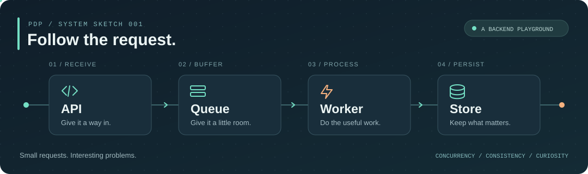

<code>pdp.dev</code> &nbsp; / &nbsp; BACKEND PLAYGROUND

# Phan Đình Phúc

I like following a request past the endpoint — into the queue, through a transaction, and back again.  
I'm an IT student at UIT, VNU-HCM, learning how to make those little journeys reliable with Java and Spring Boot.

<picture>
  <source media="(max-width: 600px)" srcset="./assets/playground-mobile.svg" />
  
</picture>

## My toolkit

   &nbsp; <strong>Build</strong> 
  Java 21 · Spring Boot · Spring Security · Spring Data JPA

   &nbsp; <strong>Store &amp; Stream</strong> 
  PostgreSQL · Redis · Apache Kafka

   &nbsp; <strong>Test &amp; Ship</strong> 
  JUnit 5 · Testcontainers · Docker · Git · Maven

## On my workbench

**01 / When requests race**  
Exploring Java concurrency, locking, and what happens when two requests want the same thing.

**02 / When messages arrive twice**  
Learning about idempotency, retries, and recovery across service boundaries.

**03 / When a test needs the real thing**  
Practicing integration testing with Testcontainers, real databases, and meaningful failure cases.

---

Curious about the moving parts. Learning by building.
